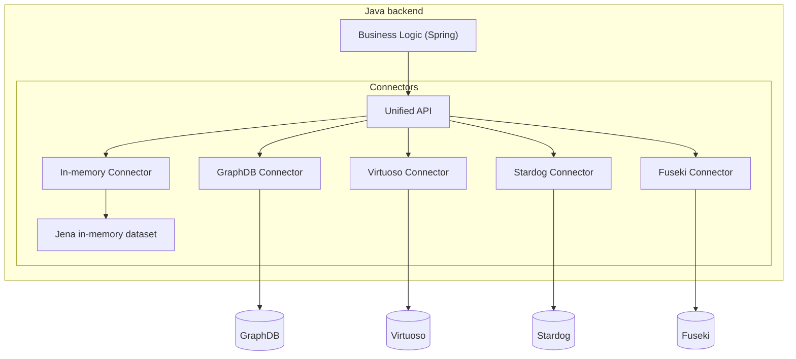

[Connectors](https://github.com/cognizone/semanticz-connectors) serve to unify access to RDF stores from JVM languages. 
The goal of this project is to offer a consistent and easy-to-use interface for accessing multiple RDF stores, 
while allowing optimizations specific to each store (Fuseki, GraphDB, Stardog, Virtuoso, etc.). This library is designed 
to be flexible, extensible, and integrable with Spring applications.

