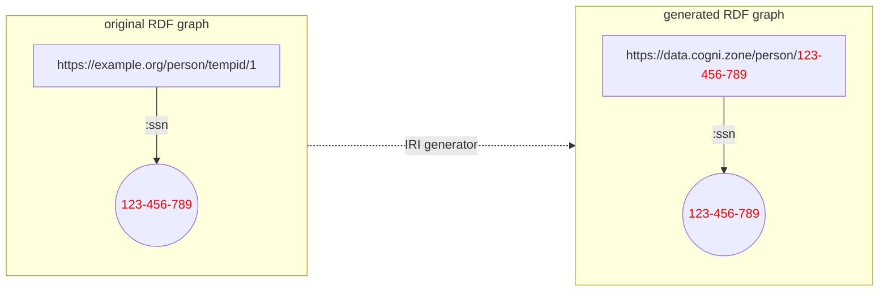

[IRI Generator](https://github.com/cognizone/semanticz-irigenerator) renames resource IRIs based on the resource properties.

```mermaid
graph LR
    original -.....->|IRI generator| after

    subgraph original["original RDF graph"]
        R1["https‎://example.org/person/tempid/1"] -->|:ssn| SSN1((<font color=red>123-456-789))
    end
    
    subgraph after["generated RDF graph"]
        R1a["https‎://data.cogni.zone/person/<font color=red>123-456-789"] -->|:ssn| SSN1a((<font color=red>123-456-789))
    end
```