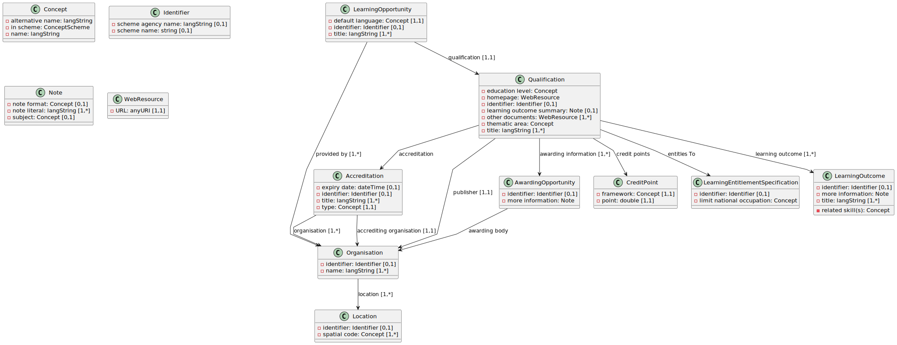
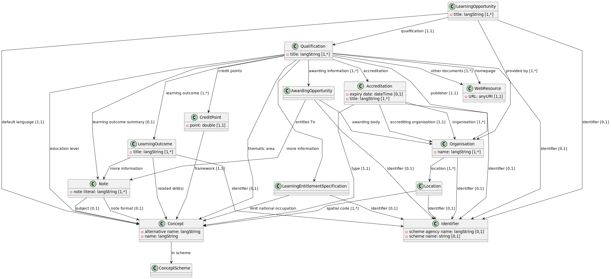

# Example Usage

- Download the SHACL Viz executable JAR:
```bash
curl -o shaclviz.jar https://repo1.maven.org/maven2/zone/cogni/semanticz/semanticz-shaclviz/1.0.2/semanticz-shaclviz-1.0.2-executable.jar
```

- The following command (run using Java 17+) creates the diagram of the [ACQF data model](https://data.acqf-qcp.africa/) (for up-to-date version check the website) preconfiguring [classes to be visualised as fields](./acqf-field-query.rq):
```bash
java -jar shaclviz.jar acqf-exchange-model.ttl acqf-exchange-model.puml --fieldQuery=acqf-field-query.rq
```


- To see how the diagram looks like with the default field selection, run:
```bash
java -jar shaclviz.jar acqf-exchange-model.ttl acqf-exchange-model-full.puml
```


- full syntax can be checked by running `java -jar shaclviz.jar` and more examples can be found [here](https://github.com/cognizone/semanticz-shaclviz).
