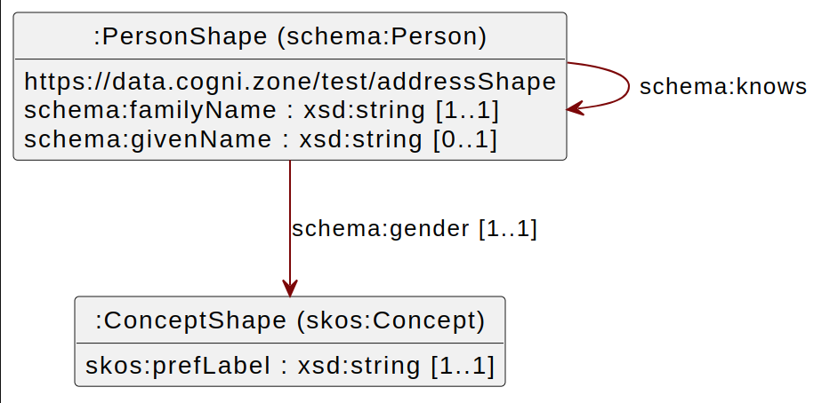
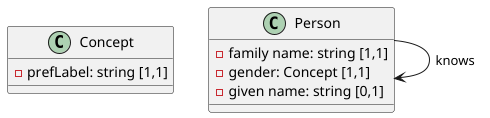

[SHACL Viz](https://github.com/cognizone/semanticz-shaclviz) draws a SHACL diagram for a _SHACL data model_ of the following form:
- each shape is an IRI (not blank node)
- each node shape has a `sh:targetClass` pointing to a single OWL class .
- each property shape has a `sh:path` pointing to a single property.

<table>
<tr><td>
Instead of SHACL-based diagrams ...

</td><td>
... SHACLViz creates OWL-based diagrams (user-defined classes can be rendered as fields - e.g. skos:Concept)

</td></tr>
</table>